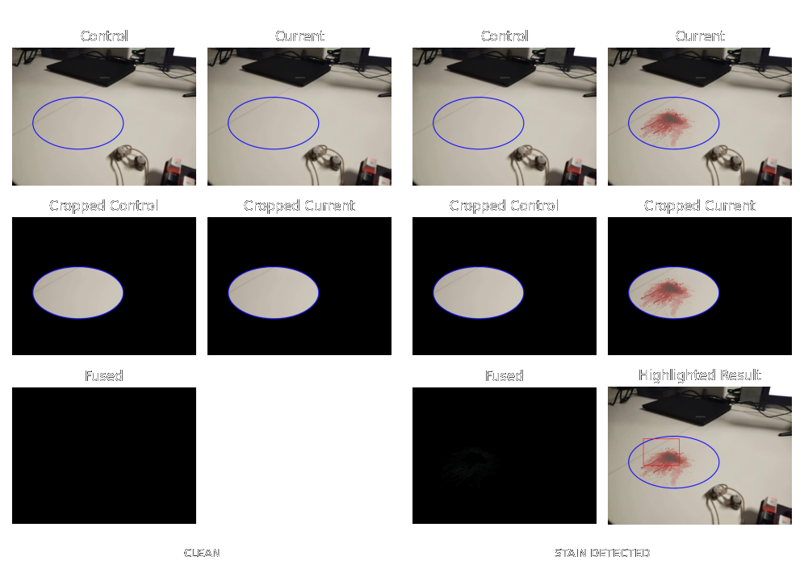

# .png)

# TabSense API

TabSense is an intelligent stain detection and surface monitoring system that automates hygiene checks across environments with precision. Built on FastAPI and MongoDB, it allows seamless capture scheduling, image comparison, and comprehensive reporting, making it ideal for large facilities, research labs, or anywhere cleanliness is non-negotiable.

## 🔬 How It Works

StainDet employs a multi-stage computational pipeline to achieve exceptional stain detection capabilities:

### 1. Intelligent Border Detection & Cropping

The system first identifies colored borders within images using **Hue-Saturation-Value (HSV)** color space analysis, automatically detecting:

- Various border colors (blue, green, yellow, red)
- Multiple border shapes (circles, rectangles, ellipses, irregular polygons)

This sophisticated border detection ensures that only the relevant content within the borders is processed, eliminating background noise and improving analysis accuracy.

### 2. Digital Image Subtraction & Fusion

The core of StainDet's detection algorithm involves a sophisticated negative-image based subtraction process:

```
Fused Image = α * Current_Image + (1-α) * Negative(Control_Image)
```

Where:
- Control_Image is a clean reference image
- Current_Image is the image being analyzed
- α is a weighting factor (typically 0.5)

This fusion technique leverages the mathematical property that when a pixel is identical in both images, the resulting value will be approximately 127 (in 8-bit grayscale). Any deviation from this value indicates a potential stain or anomaly.

### 3. Edge Enhancement & Noise Reduction

After fusion, the system applies:
- Median filtering to reduce random noise
- Edge detection algorithms to highlight boundaries
- Border cropping to focus on the region of interest

These steps enhance the visibility of subtle stains while minimizing false positives.

### 4. Intelligent Stain Localization

StainDet doesn't just detect stains—it locates them with precision:

1. The image is divided into a grid of sectors (default: 5×5)
2. Each sector is analyzed for non-black pixel density
3. The sector with the highest density of anomalous pixels is identified
4. A visual highlight is applied to the region containing the stain

This sector-based approach ensures that even small stains are accurately located within larger images.

# 

## 🔍 Features

- **Stain Detection**  
  Upload control and current images of surfaces, and TabSense will identify differences—using borders and shapes for auto-cropping and context-aware comparison.

- **Smart Scheduling**  
  Define when and where to run inspections with flexible day/time scheduling across sectors and rooms.

- **Rich Reports**  
  Generate reports over date ranges for clients and rooms. Get full detection logs, image IDs, and metadata.

- **Camera Link Management**  
  Save and manage camera feeds tied to specific sectors in specific rooms.

- **Holiday Handling**  
  Define holiday periods to suppress detections during off-hours or inactive days.

## 🚀 Getting Started

### Requirements

Install the dependencies from the `requirements.txt` file:

```
pip install -r requirements.txt
```

Ensure your environment has access to a running MongoDB instance and set the required credentials as environment variables:

```
export mongocred=your_mongo_user:your_mongo_password
```

### Running the API

To launch the server:

```
uvicorn detectapi:app --reload
```

Make sure `detectapi.py` and your image directories (`imagedata/control`, `imagedata/captures`) are correctly placed.

## 🧩 Endpoint Structure

The API is structured into five core functional zones:

1. **Detection**  
   - `/detect`: Main endpoint for stain comparison. Requires control and current image UUIDs, sector list, and room identifiers.

2. **Reports**  
   - `/report`: Fetches all detection records within a time range for a given room and client.

3. **Schedules**  
   - `/entry/*`: Add, update, delete, and fetch scheduled entries that trigger image comparisons.

4. **Cameras**  
   - `/cam/*`: Add, update, delete, and get camera links tied to sectors and rooms.

5. **Holidays**  
   - `/holiday/*`: Define and manage blackout periods where captures should be suppressed.

Each endpoint uses clear, minimalistic schemas using Pydantic for type safety. MongoDB collections are scoped by client and room for isolation and scale.

## 🗂 Directory Layout

```
TabSense/
├── detectapi.py           # Main FastAPI app with all endpoints
├── requirements.txt       # Dependency list
├── tabsense logo (Custom).png
├── imagedata/
│   ├── control/           # Control (clean) images
│   └── captures/          # Current (live) images
```

## 💡 Why TabSense?

TabSense isn't just stain detection—it's preventive hygiene intelligence. Schedule checks, analyze trends, and integrate effortlessly with your infrastructure. Whether you're cleaning up messes or catching them before they start, TabSense keeps your surfaces accountable.

## 🧠 Built With

- **FastAPI** – Blazing-fast web framework
- **MongoDB** – Flexible document-based storage
- **PIL** – Image handling
- **Custom stain detection engine (`staindet`)**

---

**Cleanliness isn't optional. Intelligence shouldn't be either.**
```
